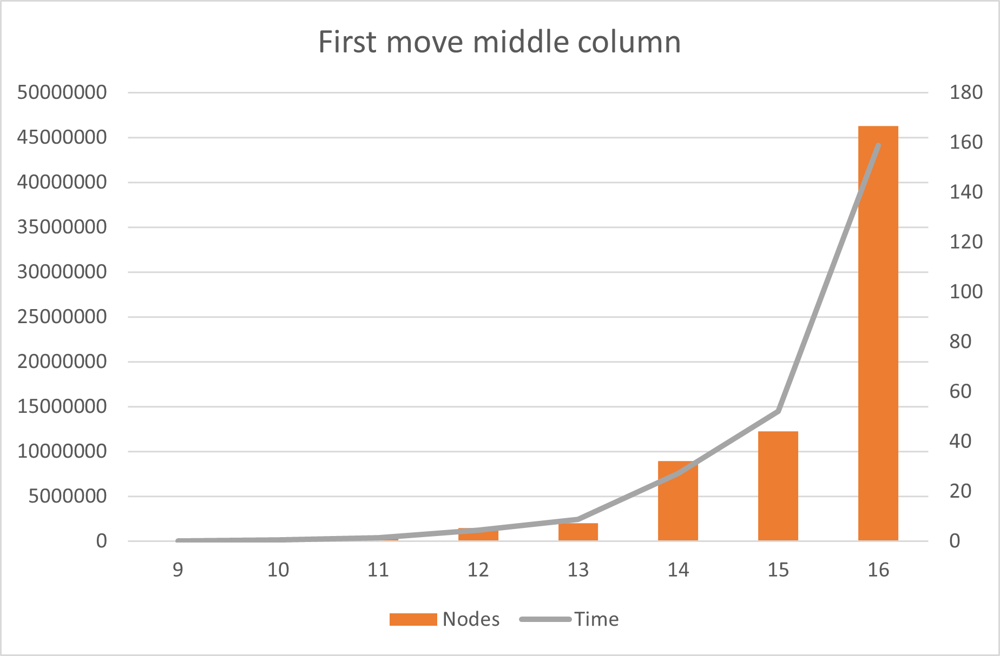

# Toteutusdokumentti

## Ohjelman yleisrakenne

Ohjelma on jaettu kolmeen osaan. [main.py](../src/main.py) on ohjelman aloituskohta, jonka avulla voi testata ratkaisijan toimintaa ja pelata tietokonetta vastaan komentoriviltä. *Board*-luokka huolehtii pelilaudasta ja tarjoaa metodeja siirtojen tekemiseen ja voittajan määrittämiseen. *Solver*-luokka toteuttaa negamax-algoritmin alpha-beta karsinnalla. Se tarjoaa myös metodin parhaan siirron löytämiseen. *TranspositionTable*-luokka toteuttaa järjestetyn hajautustaulun maksimikoolla ja LRU-korvausalgoritmilla, jota käytetään välimuistina *Solver*-luokassa. Oletuksena välimuistiin mahtuu $2^{24}$ eli $16$ miljoonaa tulosta.

## Aika- ja tilavaativuudet

Ohjleman aikavaativuuden yläraja on $O(b^d)$, missä $b$ on mahdollisten siirtojen määrä (yleensä pelilaudan leveys, eli 7) ja $d$ on hakupuun syvyys, eli jäljellä olevien mahdollisten siirtojen määrä ennen voittoa tai tasapeliä (aloitukssta tasapeliin menee $7*6=42$ siirtoa). Algoritmi ei luo kopiota pelilaudasta edetessään hakupuussa, mutta välimuisti tallentaa tietoa jokaisesta päättyneestä haarasta. Näin ollen rajallisella välimuistilla tilavaatimus on $O(1)$ ja rajattomalla yläraja on $O(b^d)$.

Alla on graafinen esitys laskenta-ajan ekspotentiaalisesta kasvusta hakusyvyyttä nostettaessa. Haun kestot ja tutkitut pelitilat on laskettu tilanteesta, jossa vasta ensimmäinen pelinappula on tiputettu keskelle. Graafista nähdään, että $16$ syvä haku käy noin $45$ miljoonaa pelitilaa $160$ sekunnissa.

## Puutteet ja parannusehdotukset

Graafinen käyttöliittymä ja yleistä optimointia. Ohjelmointikielen vaihto käännettävään kieleen, koska Pythonin bittioperaattorit ovat auttamattoman hitaita.

## Lähteet

[1] https://en.wikipedia.org/wiki/Negamax 8.4.2022
[2] https://en.wikipedia.org/wiki/Bitboard 8.4.2022
[3] https://en.wikipedia.org/wiki/MTD(f) 15.5.2022
